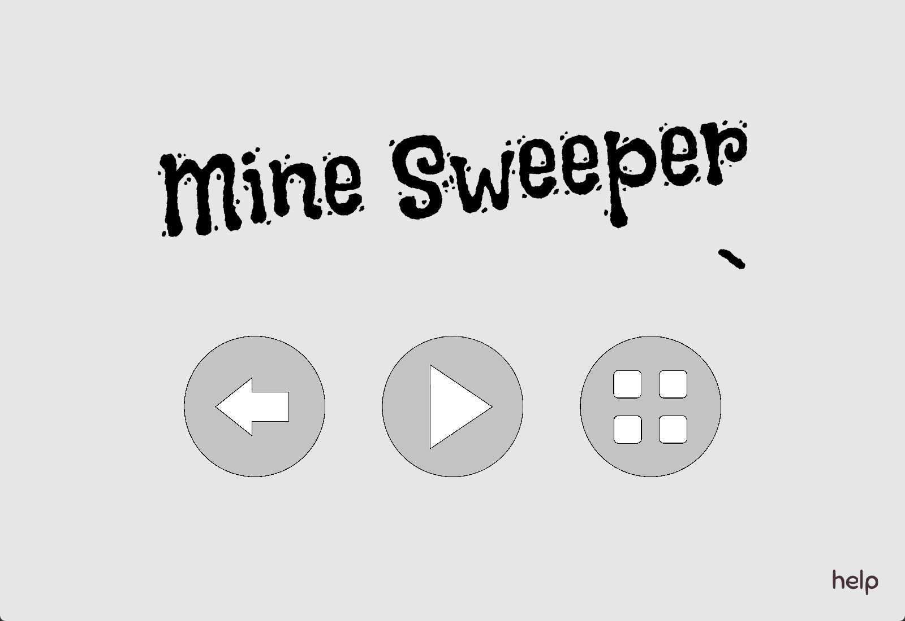
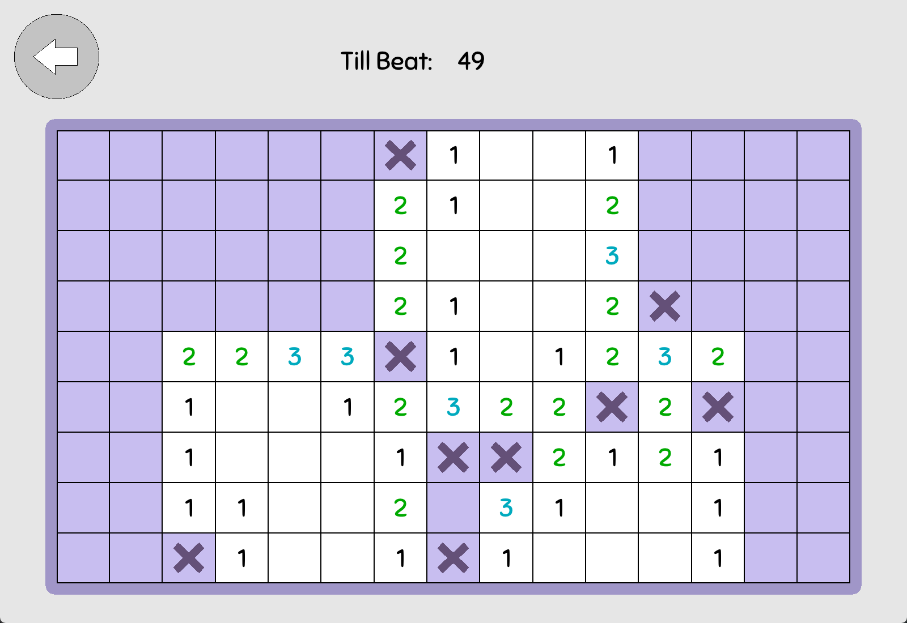
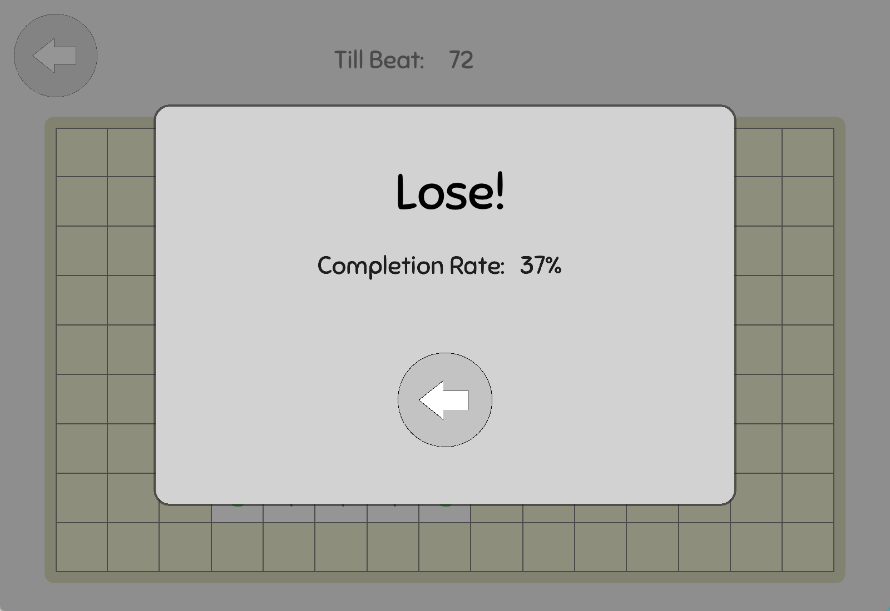

# Mine Sweeper  
## Usage:  
- Left-click: Reveal grid.  
- Right-click: Mark mine and stop Left-click. Cancel when clicked again.  
- Number on grid: Shows mine count in the surrounding 3 x 3 grids.  
- Win condition: Reveal all non-mine grids.  
---  
## Screenshots:  
  
  
  
---  
## Linux Install  
```bash
git clone https://github.com/qinmoM/Project_MineSweeper.git
cd Project_MineSweeper/
mkdir build bin && cd build
cmake -DCMAKE_BUILD_TYPE=Release ..
make

../bin/Project_MineSweeper
```  
---  
## Third-party Library:  
- Graphics & audio powered by [raylib](https://github.com/raysan5/raylib).  
- JSON storage powered by [nlohmann/json](https://github.com/nlohmann/json).  
## History:  
- C and [easyx](https://easyx.cn/) graphics library。
---  
## Resource:  
### music:  
- [Joyful Game Loop - Kitty Yarn Play](https://freesound.org/s/840648/) by Visidy -- License: Creative Commons 0.  
### sound effect:  
#### Image button sound effect:  
- [Aggressive Button Tap / UI Tap Hit](https://freesound.org/s/833601/) by subquire -- License: Creative Commons 0.  
#### Text button sound effect:  
- [Switch 1](https://freesound.org/s/844617/) by Dioram -- License: Creative Commons 0.  
#### Grid sound effect in game:  
- [Switch 3](https://freesound.org/s/844619/) by Dioram -- License: Creative Commons 0.  
### font:  
- From [Google Fonts](https://fonts.google.com/).  
### Textures/Images:  
- Created with Windows Paint.  
---  
> This is an optimized version of my MineSweeper project, used to practice project framework design.  
> The development environment is Visual Studio Code + CMake. Use C plus plus as the development language.  
> Welcome to discuss.  